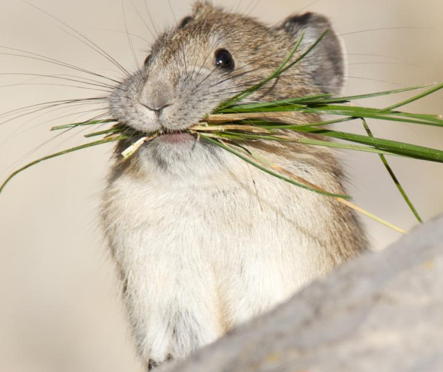

```{r, include = FALSE}
knitr::opts_chunk$set(
  collapse = TRUE,
  comment = "#>",
  fig.width = 8,
  fig.height = 6,
  dpi = 300,
  out.width = "100%"
)
```



```{r setup}
library(gordi)
library(vegan)
library(tidyverse)
```

# Introduction

The `gordi` package was developed to help students of community ecology deal with community data analysis, especially when it comes to **ordination methods** and the visualization of their results in R.

With `gordi`, you can:

-   take results from common ordinations in the **vegan** package, particularly:

    -   `rda()` for PCA and RDA
    -   `cca()` for CA and CCA
    -   `capscale()` for PCoA and db-RDA
    -   `metaMDS()` for NMDS
    -   `decorana()` for DCA


-   visualize them quickly with clear and customizable plots via the **ggplot2** framework

-   and have access to **ggplot2** for final polishing

`gordi` is still under active development, so changes happen frequently. We recommend updating the package often to get the latest features. Slight differences in results between versions may occur due to these updates. `gordi` is currently hosted on Github as it will take some time (and many bug fixes) before it will be prepared for publication on CRAN (the main R package repository). It can be installed (or updated) using this code:

```{r eval=FALSE, include=TRUE}
remotes::install_github('Kryshtoson/gordi')
```

## General Workflow

The functions in `gordi` follow some rules regarding the order in which they are called. The most important rule is, that every `gordi` workflow must start with the `gordi_read()` function. Second, `gordi_` functions work the best if applied in a pipeline, as the output (`pass`) of one function becomes the input for the next. The pipeline approach keeps your code clean and better readable.

The ordination analysis as a whole has basically three parts. The first involves data preparation. It usually consists of synchronising taxonomical concepts in the dataset, fixing mistakes, typos, deciding what to do with outlier samples, and finally, putting the data into a format, that is acceptable by the analytical software.

In the second part, the model is typically calculated. It tends to be the shortest, but the most important one.

Only in the third part, the visualisation of results, does `gordi` step in. In this vignette, we will cover the second (slightly) and predominantly the third part. The first part (data preparation) is omitted here, as it is usually highly case specific, but we will mention the format of the data which `gordi` needs to function correctly.

### 1. Calculate ordination

The first step is calculating an ordination. The `gordi` package is compatible with the outputs of `vegan` functions mentioned above.

In this example, we will use the `dune` dataset which is available in the library `vegan` to calculate a simple constrained ordination (db-RDA). We will square-root the species data (often called **spe**) to reduce the influence of dominant species. As the environmental predictor, we will use the `A1` variable which is available in the environmental table (often called **env**).

```{r}
library(gordi)
library(vegan)
library(tidyverse)

# 1. Load example dataset
data(dune)        # spe data
data("dune.env")  # env data

# 2. Check if the data have the correct format
    # e.g. species table must not contain any ID column,
    # the number of rows in spe and env table must be the same
glimpse(dune)
glimpse(dune.env)
nrow(dune) == nrow(dune.env)

# 3. Calculate the db-RDA ordination
m <- capscale(sqrt(dune) ~ A1,    
              data = dune.env,    # we have to provide env table with predictors,
                                  # so the model knows where to look for the predictor
              distance = 'bray',  # 'Bray-Curtis dissimilarity' - a common choice for community data
              sqrt.dist = T)      # square-rooted Bray-Curtis dissim. does not produce
                                  # Imaginary Inertia (negative eigenvalues),
                                  # which is problematic, when it comes to determining
                                  # how much variability in the data the model explained
```

### 2. Read the ordination result

Now it is time for the first `gordi` function. `gordi_read()` reads the resulting object of the ordination (**m**) and prepares it for use by other `gordi_` functions. That said, `gordi_read()` has to always be the first in the pipeline of `gordi_` functions.

`gordi_read()` has many arguments, which greatly influence how the final plot will look like. You can set here the scaling of the plot, select the ordination axes you want to look at. You can also provide **env**, **spe** and **traits** data which you can later use for variable based symbolisation of sites or species in the plot or for passive projection of variables onto unconstrained ordination.

For more details regarding the arguments used in the `gordi_read()` please check the help page of the `scores()` function in the `vegan` package.

> **Note**: If you check the help page for "scores", it will be rather laconic. For more details on the arguments and how do they influence the calculation of scores, you have to look for the ordination type specific `scores()` function, such as "scores.rda" or "scores.cca".

> **Note**: Don't panic when you see the large output printed to the Console. This is the `pass` object which travels through the pipeline of `gordi_` functions carrying all the necessary information needed for plotting. You can easily check if you entered the right data.

```{r}
# Print ordination result
m

# Use `gordi_read()` to read the ordination result
m |> 
  gordi_read(
    choices = 1:2,         # we want to look at the first two ordination axes
    scaling = 'species',   # we want to focus on the species
    correlation = T
  )
```

### 3. Choose, what to display

At this point, we actually start plotting. The first decision often is, whether we want to display 'species' or 'sites' (samples) scores. In the previous example we decided, we want to focus on 'species', so we set the `scaling = 'species'`.

The scaling parameter determines how the **scores** are calculated. If we set `scaling = 'species'`, the plot is optimized in a way that species relationships are displayed correctly (i.e., arrows pointing in similar directions or close together means the species co-occur or respond similarly). This applies also for the situation when we want to look at 'sites' (samples) and we set `scaling = 'sites'`.

> **Note**: The word "scores" (or "ordination scores") might sound unfamiliar, but scores are simply the "coordinates" of each species or site (sample) on the ordination axis. They represent where that site (sample) or species falls in the multidimensional space that the ordination creates.

On the other hand, if we set `scaling = 'sites'` and then we display 'species', their relative position will be harder to interpret. It still might be useful to look at both scores (sites and species) in one plot, but we have to keep on mind, that only what we scaled for will be displayed correctly.

There is also a third, compromising option how to display both, species and site (sample) scores at once, and this is `scaling = 'symmetric'`. The scores of both, species and sites, are moderately distorted ('re-scaled') but not that much as when you scale for species and display sites (and vice versa).

So, this was about scaling, but to actually display sites or species, we have to add another `gordi_` function to the pipeline:

-   If you have decided to display species, use `gordi_species()`
-   If you have decided to display sites, use `gordi_sites()`

```{r, results = 'hide', fig.show = 'asis', warning=FALSE}
m |> 
  gordi_read(choices = 1:2, scaling = 'species', correlation = T) |> 
  gordi_species()
```

OK, good. We have a bunch of blue arrows. Each arrow represent one species, but which one? For a quick information, we can set argument `label = T`.

```{r, results = 'hide', fig.show = 'asis', warning=FALSE}
m |> 
  gordi_read(choices = 1:2, scaling = 'species', correlation = T) |> 
  gordi_species(label = T)
```

Nice. We can see, that the names of species in the `dune` data set are already shortened, so we have to do nothing more about it. In case, when the data set is not that nicely prepared and you have the whole species names in the column names in the spe table (e.g. *Achillea millefolium agg.*), the plot gets crowded rapidly. For this purposes, there is a handy function `gordi_label()` which can create nice species names shortcuts.

> **Note:** Another solution for an overcrowded plot is the `gordi_fit()` function which filters out less frequent species or species which have weak correlation with the displayed ordination axes. Check its help page.

What else can we improve is the position of the species names, so they do not overlap each other. For this, set the argument `repel_label = T`.

```{r, results = 'hide', fig.show = 'asis', warning=FALSE}
m |> 
  gordi_read(choices = 1:2, scaling = 'species', correlation = T) |> 
  gordi_species(label = T, repel_label = T)
```

We can also decide, that arrows will look better in 'hotpink3'.

```{r, results = 'hide', fig.show = 'asis', warning=FALSE}
m |> 
  gordi_read(choices = 1:2, scaling = 'species', correlation = T) |> 
  gordi_species(label = T, repel_label = T, colour = 'hotpink3')
```

### 4. Change aestethics

In `gordi_species()` and `gordi_sites()` we can map colour, fill, shape, and many more things with regard to some variable ('dynamically'). Instead of setting colour = 'hotpink3', we will set `colour = 'Subclass'`. This will give different colours to species from different Subclasses.

> **Note:** For species, this variable (`Subclass`) must be supplied to the `traits` argument as a tibble or data frame. This table has a strict format: the **first column must contain species names** that exactly match the column names in the **spe** table. In every following column, every species must have assigned only one value.

```{r, results = 'hide', fig.show = 'asis', warning=FALSE}
# At first, we need to prepare traits table to be compatible with species table.
# The first column in the traits table must contain species names as used in species table
data('dune.taxon')
traits <- as_tibble(dune.taxon, rownames = 'species')

# Now we continue with the gordi pipeline
m |> gordi_read(
  env = dune.env,      # table with environmental variable
  traits = traits,     # table with traits, respective in this case,
                       # table with species names, families and 
                       # other stuff is used
  choices = 1:2,       # choose 1st and 2nd ordination axes
  correlation = T,
  scaling = 'species'  # we want to display species, we choose scaling = 'species'
  ) |>  
  gordi_species(
    colour = 'Subclass',     # colour may be set statically,
                             # or dynamically, by using name of some
                             # variable in traits data frame
    alpha = 0.8,             # opacity of symbols
    arrow_size = 0.5)        # changes arrow size (in cm)
```

However, these two functions allows you to use only the default colour palettes or shapes.

If we want to select some predefined or custom colour scale or different shapes, we have to do it immediately after `gordi_species()` or `gordi_sites()` with `gordi_colour()` and `gordi_shape()` functions. - `gordi_colour()` controls both, colour and fill (by setting argument `fill = T/F`) - `gordi_shape()` controls point shape (for details about the numbers of shape, see `?pch`)

```{r,results = 'hide', fig.show = 'asis', warning=FALSE}
m |> gordi_read(env = dune.env,      
                traits = traits,   
                choices = 1:2, 
                correlation = T,
                scaling = 'species') |>  
  gordi_species(colour = 'Subclass',     
                alpha = 0.8,             
                arrow_size = 0.5) |>       
  gordi_colour(scale = 'discrete',       # first, you must define the scale (see 
                                         # ?gordi_colour() for options)
               family = 'brewer')        # then you must select from a family of colour scales or set one manually 
```

We may want to set the colours manually. This is also possible with `gordi_colour()` (or `gordi_shape()`) and in this case, we set the first two arguments like this: `scale = 'discrete`, `family = 'manual`, and then we have to define `values = c('lightsalmon3', 'palegreen2')`

```{r, results = 'hide', fig.show = 'asis', warning=FALSE}
m |> gordi_read(env = dune.env,      
                traits = traits,   
                choices = 1:2, 
                correlation = T,
                scaling = 'species') |>  
  gordi_species(colour = 'Subclass',     
                alpha = 0.8,             
                arrow_size = 0.5,
                linewidth = 0.5) |>       
  gordi_colour(scale = 'discrete',       # first, you must define the scale (see 
                                         # ?gordi_colour() for options)
               family = 'manual',        
               values = c('lightsalmon3', 'palegreen2'))
```

### 5. Add predictors

At the beginning, we calculated constrained ordination (`RDA`). Predictors also have their scores and we will now use `gordi_predict()` to add them to the plot.

```{r, results = 'hide', fig.show = 'asis', warning=FALSE}
m |> gordi_read(env = dune.env,      
                traits = traits,   
                choices = 1:2, 
                correlation = T,
                scaling = 'species') |>  
  gordi_species(colour = 'Subclass',     
                alpha = 0.8,             
                arrow_size = 0.5,
                linewidth = 0.5) |>       
  gordi_colour(scale = 'discrete',    
               family = 'manual',        
               values = c('lightsalmon3', 'palegreen2')) |> 
  # here, we apply gordi_predict
  gordi_predict()
```

As before, we want to see the name of the predictor variable. Or possibly to change the colour, linewidth, linetype or alpha of the arrow.

```{r, results = 'hide', fig.show = 'asis', warning=FALSE}
m |> gordi_read(env = dune.env,      
                traits = traits,   
                choices = 1:2, 
                correlation = T,
                scaling = 'species') |>  
  gordi_species(colour = 'Subclass',     
                alpha = 0.8,             
                arrow_size = 0.5,
                linewidth = 0.5) |>       
  gordi_colour(scale = 'discrete',    
               family = 'manual',        
               values = c('lightsalmon3', 'palegreen2')) |> 
  # here, we apply gordi_predict
  gordi_predict(
    show_label = T,         # whether label should be shown
    repel_label = T,        # should it be repelled?
    colour = 'royalblue3',  # colour of the arrow (static - if there were more arrows, all would be the same)
    linewidth = 1.5,        # default = 1
    linetype = 4,           # default = 1, for more linetypes see linetype help page
    alpha = 0.7             # opacity of the arrow
    )
```

### 6. Customize the plot

To further customize the ordination plot, we need to do one more thing. We must end the `gordi` pipeline with `gordi_plot()` which extracts the ggplot object and makes it available for standard `ggplot2` functions. From this point, the long `pass` object, which appears in the Console every time you run some `gordi_` function is lost.

> **Note**: Don't forget, that traditional **ggplot2** functions use the `+` sign, not pipe operator `|>`.

```{r, results = 'hide', fig.show = 'asis', warning=FALSE}
library(see)
m |>
   gordi_read(env = dune.env,
              traits = traits,
              choices = 1:2,
              scaling = 'species',
              correlation = T) |> 
  gordi_species(colour = 'Subclass') |> 
  gordi_colour(scale = 'discrete', family = 'brewer') |>
  gordi_predict(show_label = T, repel_label = T, colour = 'gold') |> 
  gordi_plot() +      # from here, we are using standard ggplot2 syntax (with "+")
  theme_abyss() +     # change default theme
  labs(title = 'This is a very nice plot',                        # add custom title and subtitle
       subtitle = 'Do not try to argue with the authors.') +
  geom_point(aes(x = -0.12, y = 0.15),                            # add another layer (data must be defined manually, no plotting data pass behind the gordi_plot())
             shape = 8, size = 10, colour = 'pink', stroke = 3)  
```

## List of `gordi_` functions

```{r gordi-function-table, echo=FALSE, message=FALSE}
library(dplyr)
library(knitr)
library(kableExtra)

# 1. Create the data frame of functions and descriptions
gordi_functions <- tibble(
  `Function Name` = c(
    "`gordi_read()`", "`gordi_sites()`", "`gordi_species()`", "`gordi_predict()`",
    "`gordi_corr()`", "`gordi_fit()`", "`gordi_colour()`", "`gordi_shape()`",
    "`gordi_label()`", "`gordi_cluster()`", "`gordi_plot()`"
  ),
  `Description` = c(
    "Reads the output from the `vegan` ordination model and translates it to be used by `gordi_` functions. **(Must be first in the pipeline)**",
    "Displays **Site** (sample) coordinates (scores) and default labels.",
    "Displays **Species** coordinates (scores) and default labels.",
    "Displays **Predictor** scores from **constrained** ordinations (like RDA or CCA).",
    "**Passively fits** environmental variables onto **unconstrained** ordination axes (wrapper for `vegan::envfit`).",
    "**Filters species** based on $R^2$ with axes or frequency in the dataset. **Must be placed before `gordi_species()`**.",
    "Changes default colour palettes when mapped **dynamically**. Must be applied immediately after what it should change.",
    "Changes default point shapes when mapped **dynamically**. Must be applied immediately after what it should change.",
    "Adjusts labels for species, sites, and predictors. Useful for creating **taxon shortcuts**.",
    "Draws **spiders** or **hulls** (polygons) around groups of sites.",
    "Extracts the plot object for customization with standard **`ggplot2`** syntax."
  )
)

# 2. Render the table using kable and kableExtra for styling
gordi_functions %>%
  kable(
    caption = "List of all `gordi` functions", 
    format = "markdown" # Use markdown format for simple rendering across HTML/PDF
    # You can change 'markdown' to 'html' or 'latex' for advanced styling if needed
  ) %>%
  kable_styling(
    bootstrap_options = "striped", # Styling option for HTML
    latex_options = "HOLD_position", # Styling option for PDF
    full_width = T
  )
```

# Limitations

Even though `gordi_` can do a lot of things, there are still many parts of the intended package, which are now under construction. What you may expect it to do but is not possible yet:

-   displaying results of constrained ordination with interactions correctly. There is a discussion about how to calculate the interaction scores correctly, as they are not provided in the output from the `scores()` function (or at least many of them are missing).
-   analogue to `vegan::ordisurf`

# Contact the authors

If you run into a bug or you would welcome some feature, which is not available in `gordi`, please don't hesitate to contact the authors:

-   Štěpánka Pustková: [499933\@muni.cz](mailto:499933@muni.cz){.email}
-   Branislav Kopčan: [kopcanb\@gmail.com](mailto:kopcanb@gmail.com){.email}

You can also contact us anonymously through this [Google Form](https://forms.gle/KnrFRnYT9jv1JHCC8).
